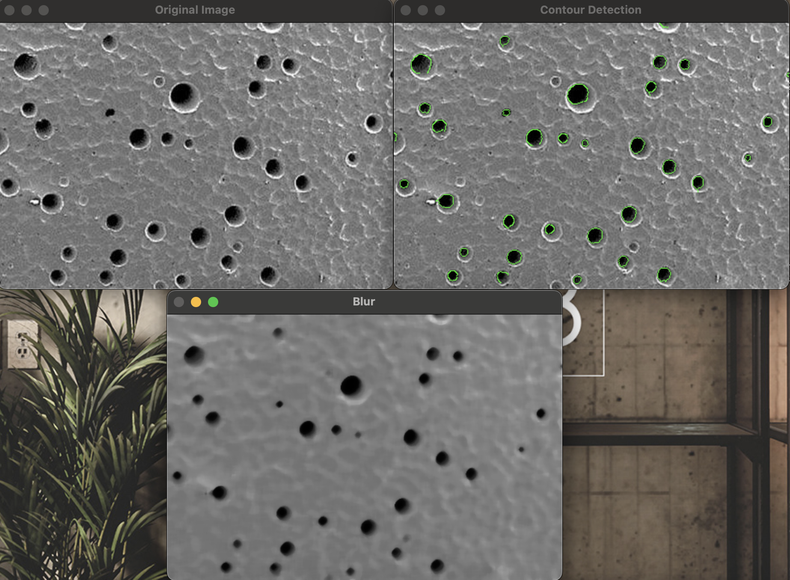

# Poro Maker
## Индивидуальная задача

Глобальная задача: создание программы, которая выполняет предобработку данных, для выделения пор на изображении.
### Автоматический режим

Программа принимает входные параметры через командную строку, пользователю нужно ввести 4 параметра: путь к изображению, размер ядра для медианного размытия, размер ядра для размытия Гаусса, пороговое значение Canny.

**Функции**:
- _преобразования изображения в оттенки серого;_
- _обработки изображения медианным размытием;_
- _обработки изображения фильтром Гаусса;_
- _пороговой обработки для выделения границ;_
- _отрисовки контуров на исходном изображении;_
- _демонстрации исходного и получившегося изображения;_

## Используемые библеотеки
* OpenCV

## Результат выполнения программы

## Ссылка на хранилище проекта
https://github.com/Mihail20052005/PoroMarker-BPM-22-1